# Exploratory Data Analysis (EDA) on Vancouver's Green Spaces

## Project Description  
This project conducts an exploratory data analysis (EDA) on Vancouver's park datasets, enriched with visitor count data, to uncover trends in park sizes, distribution, features, and visitor engagement. The goal is to generate insights that will inform urban planning, park resource allocation, and overall management.

## Project Objectives  
- Analyze the distribution and features of Vancouver’s parks.
- Enrich the dataset with visitor count data to explore engagement trends.
- Provide actionable insights to support urban planning and efficient resource allocation for park management.

## Dataset Overview  
The dataset includes detailed park information, such as:  
- **ParkID**: Unique identifier for each park.
- **Name**: Name of the park.
- **Neighbourhood**: Geographic location of the park.
- **Hectare**: Size of the park in hectares.
- **Facilities**: Available amenities (e.g., playgrounds, picnic areas, sports courts).
- **Washrooms**: Availability of washroom facilities.
- **SpecialFeatures**: Unique features like monuments or other attractions.
- **Number_of_Visits**: Enriched visitor count data.
- **GoogleMapDest**: Location coordinates for mapping.

---

## Methodology

### 1. Data Collection and Preparation  
- Load and clean the dataset, ensuring consistency and handling missing values.  
- **Data Enrichment**: Add visitor count data to enable analysis of engagement patterns.
- **Data Storage**: Store data securely in AWS S3 Glacier Instant Retrieval for cost-effective and reliable access.

### 2. Descriptive Statistics  
- Compute summary statistics to better understand park sizes, facilities, and visitor counts.  
  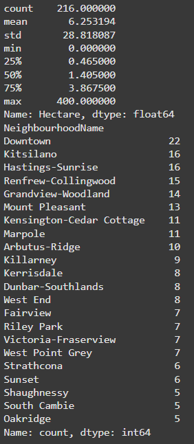

### 3. Data Profiling and Cleaning  
- Use **AWS Glue DataBrew** for data profiling, identifying missing values and inconsistencies.  
- **Cleaning Steps**:  
  - Renaming columns for clarity (e.g., "NeighbourhoodName" to "Neighbourhood").  
  - Replace missing values with "null" where necessary.  
  - Remove extra spaces in categorical fields.

### 4. Data Visualization  
- **Park Size Distribution**: Use histograms to show park size distributions in hectares.  
  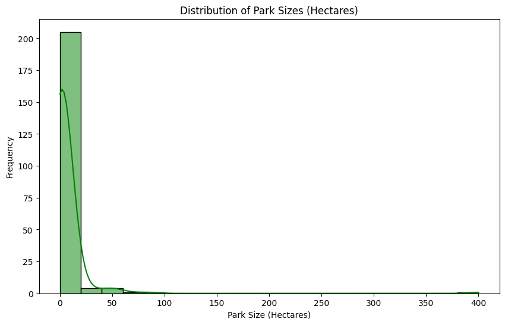
  
- **Top 10 Neighborhoods by Number of Parks**: Display bar charts of neighborhoods with the most parks.  
  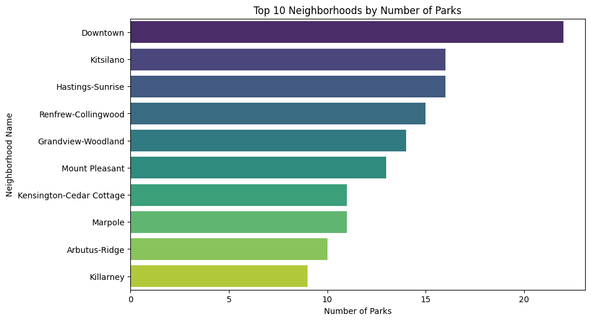
  
- **Facilities Availability**: Create pie charts for the proportion of parks with different features.  
  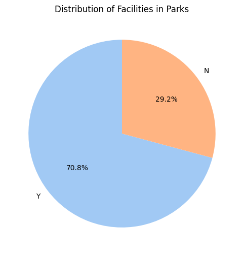

- **Visitor Engagement by Amenities**: Bar charts comparing visitor counts for parks with and without key amenities.

### 5. Geospatial Visualization  
- Use geospatial data to map the distribution of parks across Vancouver.  
  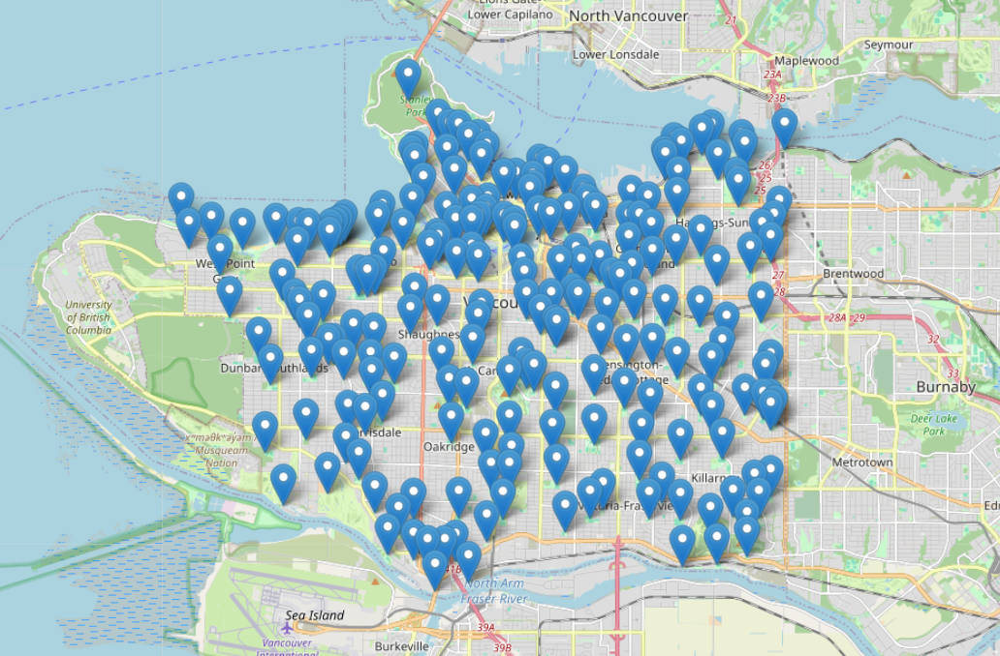

### 6. Analysis of Parks with All Three Features  
- Focus on parks offering washrooms, facilities, and special features.  
- **Key Insight**: Parks with all three amenities attract fewer but more engaged visitors (5,981 visits out of 122,936 total).  
  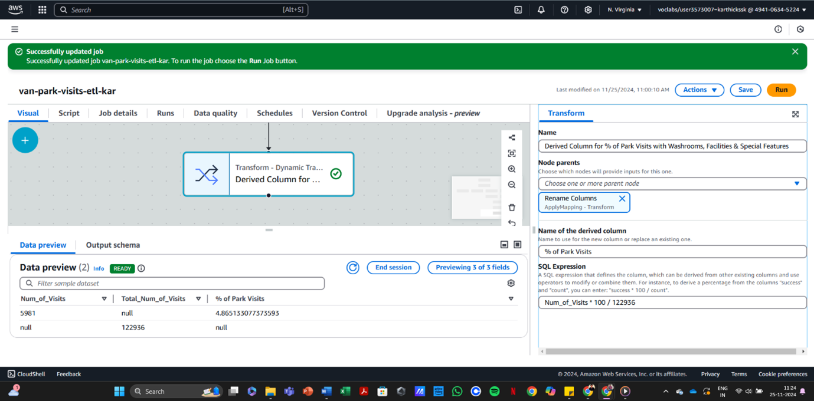

---

## Insights and Trends  

- **Neighborhoods**: Variation in visitation rates suggests areas with fewer parks could benefit from improved resources or amenities.
- **Facilities**: Parks with amenities like washrooms and playgrounds experience higher visitor counts.
- **Park Sizes**: A small number of large parks contribute significantly to visitor engagement, while most parks are smaller.

---

## Tools and Technologies  

- **Data Storage**: AWS S3 Glacier Instant Retrieval for cost-efficient storage.  
- **Data Profiling and Cleaning**: AWS Glue DataBrew for data quality checks.  
- **Analysis and Visualization**: Python libraries (Pandas, Matplotlib, Seaborn, GeoPandas, Shapely) for data analysis and visualization.  
- **Environment**: Jupyter Notebook for interactive data analysis and documentation.

---

## Deliverables  
- **Jupyter Notebook**: Contains data enrichment steps, descriptive statistics, visualizations, and detailed insights.  
- **Presentation**: Summarizes findings with key visualizations for stakeholders, offering actionable recommendations.

# Descriptive Analysis

## Project Description
**Exploring Vancouver’s Green Spaces: An Insightful Data Analysis**  
This project performs an exploratory data analysis (EDA) on datasets of Vancouver parks, enriched with visitor count information. The analysis aims to identify key insights about park sizes, distribution, features, facilities, and how these factors influence visitor counts. The findings will support urban planning and park management.

## Project Title
**Understanding Vancouver’s Green Spaces: An Insightful Data Analysis**

## Objective
The primary goal of this project is to conduct an exploratory data analysis (EDA) of Vancouver parks. We aim to uncover trends about park distribution, park features, and how these factors influence visitor counts. The findings will provide actionable insights that can guide urban planning, park resource allocation, and future developments of green spaces.

## Dataset
The dataset contains detailed information about parks in Vancouver, including:
- **ParkID**: Unique identifier for each park
- **Name**: Name of the park
- **Neighbourhood**: Geographic location of the park
- **Hectare**: Size of the park in hectares
- **Facilities**: Availability of features like playgrounds, picnic areas, or sports courts
- **Washrooms**: Presence of washroom facilities
- **SpecialFeatures**: Unique features such as monuments or attractions
- **Number_of_Visits**: Total number of visits to each park (added during data enrichment)
- **GoogleMapDest**: Location for mapping and navigation

## Methodology

### 1. Data Collection and Preparation
- The dataset was loaded, enriched, and cleaned to ensure consistency and handle missing values.
- **Data Enrichment**: Added the **Number_of_Visits** feature to enable visitor analysis.
- **Data Storage**: Used AWS S3 Glacier Instant Retrieval for secure and cost-effective storage.

### 2. Descriptive Statistics
- Summary statistics were computed to understand park sizes, amenities, and visitor counts.
- Key metrics include average park size, the distribution of park features, and visitor engagement levels.

### 3. Data Profiling and Cleaning
- **Profiling**: AWS Glue DataBrew was used to identify missing values, inconsistencies, and data quality issues.
- **Cleaning Steps**:
  - Renamed columns for clarity (e.g., NeighbourhoodName to Neighbourhood).
  - Replaced missing values in critical columns with "null".
  - Removed leading/trailing white spaces in categorical fields.

### 4. Data Visualization
- **Park Size Distribution**: Histogram showing the distribution of park sizes in hectares.
- **Top 10 Neighborhoods by Number of Parks**: Bar chart highlighting neighborhoods with the most parks.
- **Facilities Availability**: Pie chart depicting the proportion of parks with specific features like washrooms or playgrounds.
- **Visitor Engagement by Amenities**: Bar charts comparing visit counts for parks with and without specific amenities.

### 5. Geospatial Visualization
- Using geospatial data, parks were mapped to visualize their geographic distribution in Vancouver.

### 6. Analysis of Parks with All Three Features
- Focused analysis on parks with **Washrooms**, **Facilities**, and **Special Features**.
  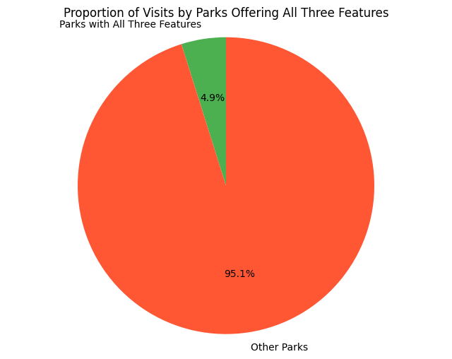
- **Total Visits**: Of 122,936 visits, 5,981 were to parks with all three amenities.
- **Key Insight**: Parks with comprehensive features attract fewer but more engaged visitors.

### 7. Insights and Trends
- **Neighborhoods**: Significant variation in visitation rates, highlighting opportunities for targeted improvements in certain neighborhoods.
- **Facilities**: Parks with washrooms and playgrounds attract higher visitor counts.
- **Park Sizes**: Most parks are small, with a few large green spaces contributing disproportionately to visitor engagement.

## Tools and Technologies
- **Data Storage and Retrieval**: AWS S3 Glacier Instant Retrieval.
- **Data Profiling and Cleaning**: AWS Glue DataBrew.
- **Analysis and Visualization**: Python Libraries (Pandas, Matplotlib, Seaborn, GeoPandas, Shapely).
- **Environment**: Jupyter Notebook for interactive data exploration and documentation.

## Deliverables
- **Jupyter Notebook**: Includes data enrichment, descriptive statistics, visualizations, and detailed insights.
- **Presentation**: Summarizes findings with key visualizations for stakeholders.

# Diagnostic Analysis

## Project Description
**Investigating the Causes of Visitor Decline at Vancouver Parks**  
The primary goal of this project is to conduct a diagnostic analysis to identify potential factors contributing to visitor decline in Vancouver's parks. By analyzing various datasets, we aim to uncover key patterns and trends that may explain why certain parks experience lower visitor counts and offer actionable insights for improving park utilization and visitor engagement.

## Project Title
**Investigating the Causes of Visitor Decline at Vancouver Parks**

## Objective
The objective of this project is to identify factors influencing lower visitor counts in certain Vancouver parks. This analysis will focus on variables such as park features, location, amenities, and visitor engagement. Insights from this analysis will support park management in developing strategies to enhance park usage, improve resource allocation, and better meet the needs of visitors.

## Background
Vancouver’s parks are a vital part of the city’s green spaces, but there has been a noticeable variation in visitor counts across different parks. This diagnostic analysis will investigate possible causes of this variation, focusing on park attributes, facilities, and external factors such as location and accessibility.

## Dataset
The analysis will utilize the following datasets:
- **Park Data**: Information about each park including park size, facilities, special features, and neighborhood location.
- **Visitor Data**: Enriched data with the total number of visits to each park over a set period.
- **Geospatial Data**: Geographic location and mapping details for visualizing park distribution.
- **Facilities Data**: Information on park amenities such as washrooms, playgrounds, picnic areas, and special features.

## Methodology

### 1. Data Collection and Preparation
- Consolidate the dataset containing park details and visitor data.
- Clean and preprocess the data by handling missing values, correcting inconsistencies, and normalizing the dataset for analysis.

### 2. Trend Analysis
- Analyze trends in park visitation over time to identify periods with the most significant decline in visitor numbers.
- Examine park characteristics to identify which attributes correlate with higher or lower visitor counts.

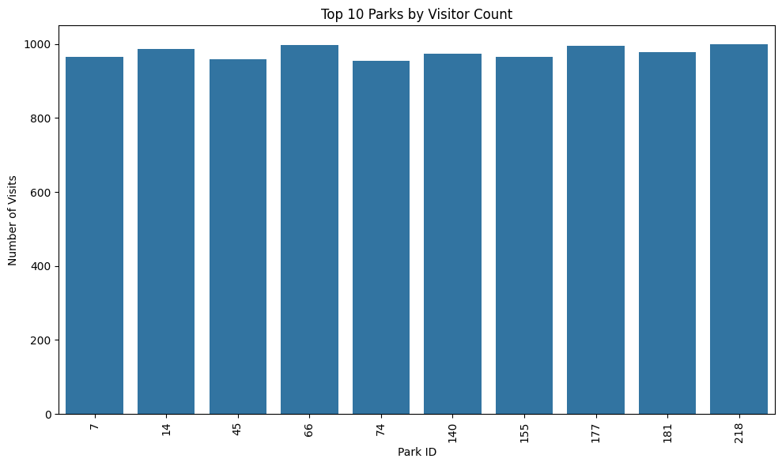

### 3. Correlation Analysis
- Identify correlations between park size, facilities, and visitor count.
- Use statistical methods like regression analysis to determine how these factors contribute to higher or lower park engagement.

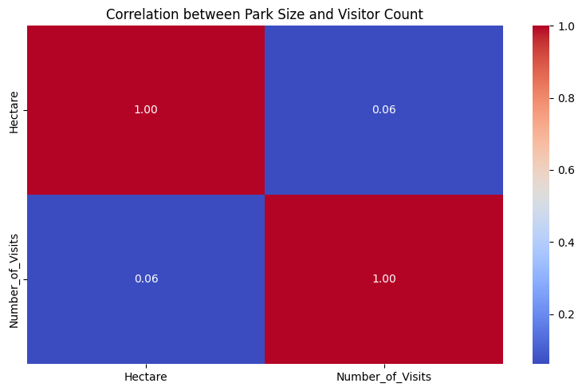

### 4. Root Cause Analysis
- Investigate external factors such as park location and accessibility.
- Conduct an analysis of neighborhoods with lower visitation to see if socio-economic factors or other regional issues contribute to the decline.

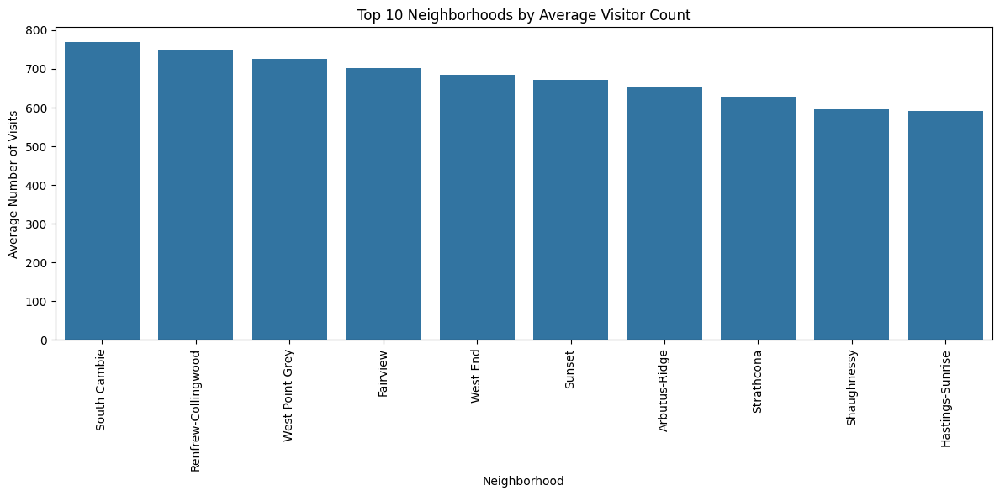
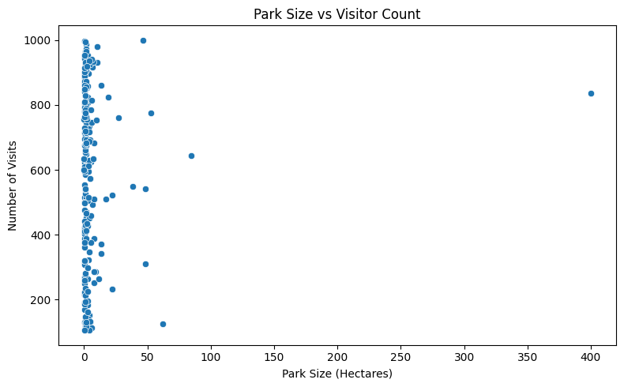

### 5. Segmentation Analysis
- Segment parks based on their characteristics (e.g., size, amenities) to determine whether certain types of parks attract more visitors than others.
- Analyze visitor patterns to identify specific groups (e.g., families, tourists) who may have different preferences and visitation habits.

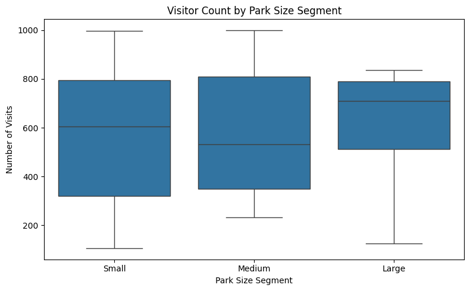

### 6. Synthesis of Findings
- Integrate quantitative (visitor data) and qualitative (facility analysis, neighborhood data) information to uncover key factors influencing park visits.
- Identify opportunities for targeted improvements based on the analysis, such as enhancing amenities in less-visited parks or improving park accessibility in certain neighborhoods.

## Tools and Technologies
- **Data analysis tools**: Python (Pandas, Matplotlib, Seaborn), R for metrics calculation and trend analysis.
- **Geospatial analysis tools**: GeoPandas and Shapely for mapping park locations and analyzing spatial patterns.
- **Data visualization tools**: Tableau for interactive dashboards and clear visual representation of findings.

## Deliverables
- **Diagnostic Report**: A detailed report summarizing the methodology, analysis, and confirmed factors contributing to the decline in park visits.
- **Visualizations**: Clear visualizations such as heatmaps, bar charts, and scatter plots to illustrate trends and patterns.
- **Actionable Recommendations**: Strategic recommendations for improving park management, focusing on increasing visitor engagement through targeted park improvements or marketing efforts.

## Timeline
- **Expected completion**: 6 weeks from project initiation, including check-ins with stakeholders (e.g., park management or local government) to validate insights and adjust strategies.

This diagnostic analysis will provide park management with the insights needed to address visitor decline, improve resource allocation, and optimize the use of Vancouver’s green spaces.
